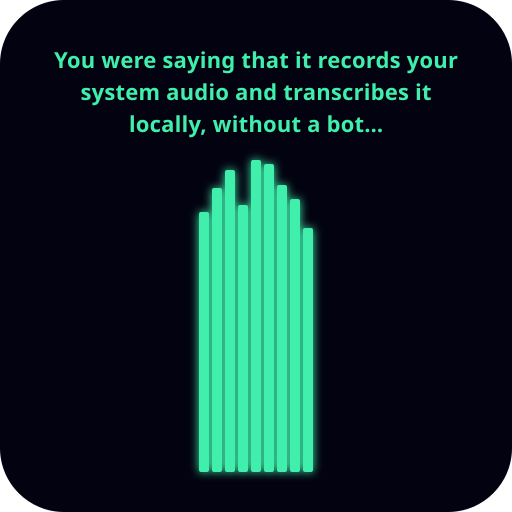

<p align="center"></p>

# Turingram

Turingram records your meetings from your own desktop, with no bot in the call. It captures your microphone and the other participants on separate channels, sends the audio to Deepgram for transcription and speaker separation, and asks Google Gemini for a title, a summary and action items. Every finished meeting is also written as a JSON file to a folder you choose, so a coding agent or a notes vault can read it.

It runs on your own API keys. You pay Deepgram and Google directly, and nothing passes through a Turingram server.

## Platforms

| | macOS | Windows | Linux |
|---|---|---|---|
| Microphone capture | yes | yes | yes |
| System audio (the other participants) | yes, needs Screen Recording permission | yes | yes, through PipeWire or PulseAudio |
| Choose the microphone | yes | yes | yes |
| Offer to record when a call starts | yes, macOS 14.2 or later | yes, for known call apps | yes |
| Start at login | yes | yes | yes |

macOS needs version 13 Ventura or later, because system audio capture uses ScreenCaptureKit.

Meeting detection watches which apps use the microphone, and it only ever asks. On Linux it reads the sound server with `pactl`. On macOS the audio helper reads CoreAudio's per-app audio state, which needs macOS 14.2 and no permission. On Windows it reads the privacy settings' record of microphone use. That record says nothing about playback, so Windows offers only for known call apps, such as Zoom, Teams, Webex, Slack, Discord and the major browsers. Detection on macOS and Windows is new. If it misses a call, open an issue.

## API keys

Turingram needs two keys.

- **Deepgram** transcribes the audio and separates the speakers. Get a key at <https://console.deepgram.com/signup>. Without it, the app records and transcribes nothing.
- **Google Gemini** writes the title, summary, action items and speaker names. Get a key at <https://aistudio.google.com/apikey>. Without it, you still get the full transcript.

Create the Gemini key on a Google Cloud project with billing turned on. Google's terms for the unpaid tier allow human review and model training on what you send, and they tell you not to send confidential information. A meeting transcript is confidential information.

Enter both keys in Settings → Provider keys. The app writes them to a `.env` file in its data directory with `0600` permissions. It sends each key only to the provider that issued it, and the Settings screen never shows a saved key again.

## Your data

Audio, the database, transcripts and the `.env` stay on your machine, in one directory:

- macOS: `~/Library/Application Support/turingram-workspace`
- Windows: `%APPDATA%\turingram-workspace`
- Linux: `~/.config/turingram-workspace`

The app sends the recorded audio to Deepgram and the transcript text to Gemini. It deletes the audio after transcription unless you turn on "keep recordings" in Settings. To remove everything, uninstall the app and delete that directory.

## Recording consent

Recording-consent laws differ between countries and between US states. Some require every participant to agree. You are responsible for telling the other people on the call and getting their consent where the law requires it. Turingram shows a consent reminder before your first recording.

## Build from source

You need Node.js 22 and npm. On Linux you also need `ffmpeg`, `pactl` (from `pulseaudio-utils`) and a C++ toolchain for the native modules.

```sh
npm ci
npm run build
npm test
```

To run the app in development, start the renderer dev server in one terminal:

```sh
npm run dev:renderer
```

Then rebuild the native modules for Electron and start the app in a second terminal:

```sh
npm run rebuild-native
NODE_ENV=development npm run electron
```

`npm test` rebuilds `better-sqlite3` for Node when the Electron build is the one installed, so you can switch between the two.

To build installers for your own platform:

```sh
npm run dist
```

The output goes to `release/`. The installers are not code-signed, so macOS and Windows warn you on first launch. `build/build-ffmpeg.sh` builds the minimal LGPL ffmpeg that the installers bundle. The workflow in `.github/workflows/release.yml` builds all three platforms on GitHub Actions.

## Buy me a drink

Turingram is free. After every 12 hours of recording, it asks you to buy the developer a drink. A drink costs from $4 to $48 and goes through Stripe Checkout. After the payment, the thank-you page shows a token. Paste it into Settings → Buy me a drink, and the app stops asking on that computer. The app checks the token offline against a public key in `packages/main/src/drinks.ts`. No setting turns the ask off, but you can just reject it every time. Or hey, it's open source; you're welcome to rebuild it yourself without the nag.

## Website

`marketing/` holds the source of the Turingram website, a Vite and React app. `npm run build` in that directory writes the site to `marketing/dist`. The comparison table reads competitor prices from `marketing/public/prices.json`, which is edited by hand. The workflow `.github/workflows/update-prices.yml` can refresh that file with Gemini, but it is disabled and needs a `GEMINI_API_KEY` secret.

## License

Turingram is free software under the GNU General Public License, version 3. See `LICENSE`.
